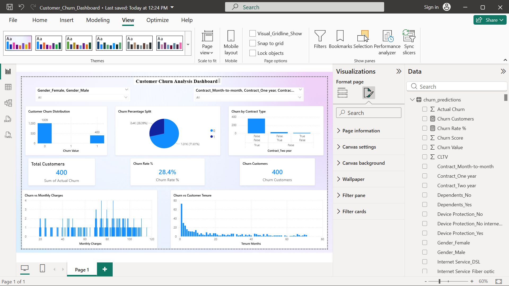
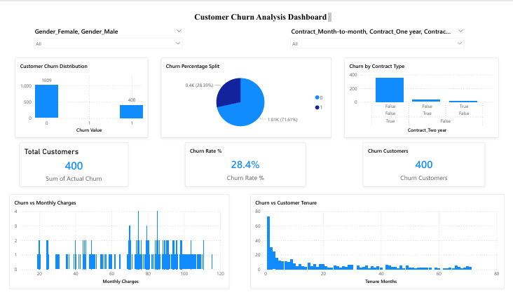

# customer-churn-prediction
ML model + Power BI dashboard to predict telecom customer churn

# customer-churn-prediction

Machine Learning model and Power BI dashboard to predict telecom customer churn and visualize business insights.

---

## Dashboard
-preview

-image

---

## Project Overview

This project predicts customer churn using Machine Learning and presents insights through an interactive Power BI dashboard. It helps businesses identify customers likely to leave and take proactive retention actions.

---

## Problem Statement

Customer churn is a major challenge in the telecom industry. Losing customers impacts revenue and growth. The goal of this project is to:

* Predict whether a customer will churn
* Analyze factors influencing churn
* Visualize churn patterns using Power BI

---

## Dataset Information

The dataset contains telecom customer information such as:

* Gender
* Senior Citizen status
* Contract type
* Tenure months
* Monthly charges
* Internet services
* Support services
* Payment method
* Churn label

---

## Project Workflow

1. Data Collection
2. Data Cleaning and Preprocessing
3. Feature Encoding
4. Train-Test Split
5. Model Building (Logistic Regression)
6. Model Evaluation
7. Prediction Export to CSV
8. Power BI Dashboard Creation

---

## Machine Learning Model

Algorithm used:

Logistic Regression

Reason for selection:

* Works well for binary classification
* Interpretable results
* Efficient on structured datasets

---

## Model Evaluation Metrics

* Accuracy Score
* Confusion Matrix
* Classification Report
* Precision
* Recall
* F1 Score

---

## Power BI Dashboard Features

The dashboard provides the following insights:

* Churn distribution (Yes vs No)
* Churn rate percentage
* Total churn customers
* Contract type vs churn
* Monthly charges impact
* Tenure analysis
* Interactive slicers for filtering

---

## Key Insights

* Customers with month-to-month contracts show higher churn
* Higher monthly charges increase churn probability
* Customers with low tenure are more likely to churn
* Long-term contract customers have lower churn rates

---

## Tools and Technologies

Programming and Analysis:

* Python
* Pandas
* NumPy
* Scikit-learn

Visualization:

* Power BI

Development Environment:

* Jupyter Notebook
* Anaconda

---

## Project Structure

customer-churn-prediction/

* churn_data.csv → Raw dataset
* churn_project.ipynb → ML model notebook
* churn_predictions.csv → Model predictions
* Customer_Churn_Dashboard.pbix → Power BI dashboard
* Customer_churn_dashboard.png → Dashboard image
* README.md → Project documentation

---

## How to Run the Project

Step 1: Clone the repository

git clone [https://github.com/your-username/customer-churn-prediction.git](https://github.com/your-username/customer-churn-prediction.git)

Step 2: Install dependencies

pip install pandas numpy scikit-learn matplotlib seaborn

Step 3: Run the notebook

Open churn_project.ipynb in Jupyter Notebook and execute all cells.

Step 4: Open Power BI dashboard

Open Customer_Churn_Dashboard.pbix in Power BI Desktop.

---

## Business Impact

This solution helps telecom companies:

* Identify high-risk customers
* Improve retention strategies
* Reduce revenue loss
* Enhance customer satisfaction

---

## Future Improvements

* Use advanced models (Random Forest, XGBoost)
* Deploy as a web application
* Automate real-time predictions
* Add customer segmentation

---

## Author

Ashish Kumar
Data Science Enthusiast

---

## License

This project is open source and available under the MIT License.
